# 零基础学AI：深度阅读笔记与学习指南

> 本文是基于《零基础学AI》（yeasy，v1.0.3，2026-04-05）整理的博客发布版深度阅读笔记。内容不复制原书全文，而是把原书结构转化为可执行的阅读计划、章节笔记、概念卡、问题卡、输出模板与复习系统。

## 文章信息

- 原书：**《零基础学AI》**
- 作者：**yeasy**
- 版本：**v1.0.3**
- 原书日期：**2026-04-05**
- 适用对象：AI 零基础学习者、希望系统理解 AI 技术版图的知识工作者、准备搭建个人 AI 知识库的读者

## 如何使用这篇笔记

建议按三层阅读：

1. **快速掌握全貌**：先读“全书总览”和“30 分钟检视阅读”。
2. **逐章主动阅读**：每章只抓“核心观点、主动问题、逻辑重构、行动转化”。
3. **输出驱动内化**：用概念卡、问题卡和费曼输出模板，把知识转化为自己的表达。

## 目录

- [使用说明](##使用说明)
- [全书总览](##全书总览)
- [逐章深度阅读笔记](##逐章深度阅读笔记)
- [核心概念卡片](##核心概念卡片)
- [批判性问题卡片](##批判性问题卡片)
- [输出模板](##输出模板)
- [复习系统](##复习系统)
- [实战练习](##实战练习)
- [原文线索](##原文线索)

---

## 使用说明

### 阅读说明

#### 这篇笔记是什么

这不是原书全文搬运，而是一个 **深度阅读工作台**：

- 把 PDF 的章节结构整理成可发布、可复习的 Markdown 笔记；
- 把关键概念拆成原子卡片；
- 把每章转换为“阅读目的 → 主动问题 → 逻辑重构 → 批判分析 → 输出练习 → 复习计划”；
- 提供可直接复制使用的模板和复习系统。

#### 建议阅读节奏

- **第 1 遍：检视阅读**：只看 30分钟检视阅读 和 全书逻辑地图。
- **第 2 遍：主动阅读**：每章阅读原文，同时填写章节笔记中的“我的理解”和“疑问”。
- **第 3 遍：输出阅读**：用 费曼输出模板 把每章讲给一个零基础读者。
- **第 4 遍：网络化阅读**：把章节中的概念连接到 `03-概念卡片`。

#### 标记系统

| 标记 | 含义     | 用法                               |
| ---- | -------- | ---------------------------------- |
| `★`  | 核心观点 | 值得放进永久笔记                   |
| `?`  | 疑问     | 放进问题卡片                       |
| `↔`  | 关联     | 与其他章节、概念或现实案例建立链接 |
| `!`  | 反直觉   | 适合做输出文章或讨论题             |
| `A`  | 行动     | 可立刻实践的应用点                 |

#### 每章最低完成标准

每读完一章，至少完成四件事：

1. 用一句话说明本章解决什么问题；
2. 写出 3 个关键词并链接到概念卡；
3. 写出 1 个批判性问题；
4. 用 150 字做一次费曼复述。

---

### 内容索引

> 本文基于《零基础学AI》（yeasy，v1.0.3，2026-04-05）制作，目标是把一本线性 PDF 转换为可链接、可复习、可输出的知识网络。

#### 使用顺序

1. 先读：阅读说明
2. 快速掌握全书：30分钟检视阅读、全书逻辑地图
3. 按章节精读：从 Ch01｜走进人工智能世界 开始
4. 建立概念网络：从 人工智能 AI、机器学习 ML、大语言模型 LLM 开始
5. 输出与复盘：使用 费曼输出模板、章节笔记模板、间隔重复计划

#### 章节索引

- Ch01｜走进人工智能世界
- Ch02｜AI 核心概念速览
- Ch03｜AI 技术生态与工具全景
- Ch04｜机器学习原理
- Ch05｜深度学习揭秘
- Ch06｜大语言模型详解
- Ch07｜推理模型与推理计算
- Ch08｜新架构与创新案例
- Ch09｜多模态与生成式 AI
- Ch10｜主流 AI 工具使用指南
- Ch11｜提示词工程入门
- Ch12｜提示词工程进阶与上下文工程
- Ch13｜AI 实战应用场景
- Ch14｜AI 智能体与多智能体系统
- Ch15｜AI 伦理、安全与未来
- Ch16｜AI 硬件与量子计算入门

#### 核心概念入口

- 人工智能 AI
- 机器学习 ML
- 深度学习 DL
- 数据
- 算法
- 模型
- 训练
- 推理
- 损失函数
- 监督学习
- 无监督学习
- 强化学习
- 自监督学习
- 神经网络
- Transformer
- 注意力机制
- 大语言模型 LLM
- 预训练
- 微调
- 生成式AI
- 多模态
- 扩散模型
- 提示词工程
- 上下文工程
- RAG
- MCP
- 智能体 Agent
- 多智能体
- MoE
- MLA
- 长上下文
- AI伦理
- GPU TPU NPU

#### 推荐工作流

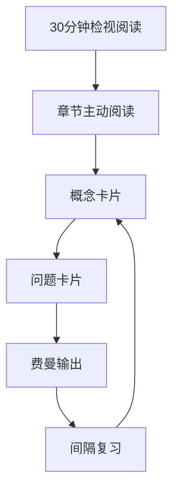

---

## 全书总览

### 30分钟检视阅读

#### 目标

在不陷入细节的情况下，先判断这本书的结构、主线和阅读价值。

#### 0-5 分钟：定位本书

- 书名：**零基础学AI**
- 作者：yeasy
- 版本：1.0.3
- 日期：2026-04-05
- 读者定位：AI 零基础学习者、知识工作者、希望建立 AI 基础框架的人。
- 文体特点：通俗类比 + 技术概念 + 工具应用 + 趋势展望。

#### 5-15 分钟：浏览目录，抓主线


#### 15-25 分钟：找出核心问题

1. AI 与传统软件的根本差异是什么？
2. 数据、算法、算力各自扮演什么角色？
3. 机器学习、深度学习、大语言模型之间如何连接？
4. 提示词工程为什么会走向上下文工程？
5. 智能体与多智能体系统是否代表下一阶段应用形态？
6. AI 的风险、边界与未来硬件约束是什么？

#### 25-30 分钟：决定阅读策略

| 目标                | 阅读重点  | 可快读章节        |
| ------------------- | --------- | ----------------- |
| 建立 AI 常识        | Ch01-Ch03 | Ch16 可浏览       |
| 理解技术原理        | Ch04-Ch08 | Ch10-Ch13 可快读  |
| 提升 AI 使用能力    | Ch10-Ch14 | Ch04-Ch08 可概览  |
| 做行业/职业转型判断 | Ch13-Ch16 | Ch05 数学可选部分 |

#### 检视阅读结论

这本书最适合作为 **AI 基础认知地图**，不是数学教材，也不是工程实战手册。最佳读法是：先建立概念框架，再用外部实践补足代码、工具和项目经验。

---

### 全书逻辑地图

#### 一句话概括

《零基础学AI》试图回答：**普通人如何从“听说 AI”过渡到“理解 AI 的基本原理、工具生态、应用方式与未来风险”？**

#### 五层结构

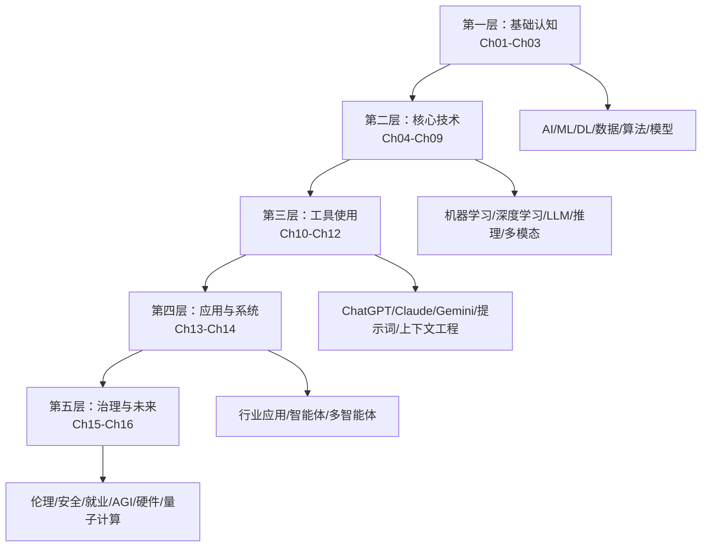

#### 核心论证链

1. **AI 的本质变化**：从人工写规则到用数据训练模型。
2. **AI 的能力来源**：数据、算法、算力三者共同作用。
3. **AI 的技术演进**：机器学习 → 深度学习 → Transformer/LLM → 推理模型/新架构/多模态。
4. **AI 的使用升级**：工具使用 → 提示词 → 上下文工程 → 智能体系统。
5. **AI 的现实约束**：成本、隐私、偏见、安全、就业影响、硬件瓶颈与治理问题。

#### 阅读中的关键张力

| 张力                 | 问题                       |
| -------------------- | -------------------------- |
| 规则 vs 学习         | AI 何时比传统软件更适合？  |
| 数据 vs 算法         | 模型能力到底由什么决定？   |
| 通用能力 vs 垂直场景 | 通用模型如何进入具体行业？ |
| 提示词 vs 上下文     | 为什么只会写提示词不够？   |
| 自动化 vs 责任       | AI 做事后，错误由谁负责？  |
| 长上下文 vs RAG      | 把资料全塞进去是否足够？   |

---

### 21天深度阅读计划

#### 计划原则

- 每天 45-75 分钟；
- 每 3 天做一次输出；
- 每章都要产出至少 1 张概念卡和 1 张问题卡；
- 第 21 天只做整合，不读新内容。

#### 日程表

| 天数 | 阅读任务                         | 输出任务                           |
| ---- | -------------------------------- | ---------------------------------- |
| D1   | 30分钟检视阅读 + 全书逻辑地图    | 写下 5 个阅读目标                  |
| D2   | Ch01｜走进人工智能世界           | 费曼解释“AI 为什么不是写规则”      |
| D3   | Ch02｜AI 核心概念速览            | 画出 AI/ML/DL/数据/算法/模型关系图 |
| D4   | Ch03｜AI 技术生态与工具全景      | 列出你常用 AI 工具属于技术栈哪一层 |
| D5   | Ch04｜机器学习原理               | 比较监督/无监督/强化/自监督学习    |
| D6   | Ch05｜深度学习揭秘               | 解释“自动特征学习”                 |
| D7   | 第一次复盘                       | 整理 10 张概念卡                   |
| D8   | Ch06｜大语言模型详解             | 费曼解释 Transformer 与 LLM        |
| D9   | Ch07｜推理模型与推理计算         | 判断 5 个任务是否需要推理模型      |
| D10  | Ch08｜新架构与创新案例           | 写出长上下文、MoE、DeepSeek 的关系 |
| D11  | Ch09｜多模态与生成式 AI          | 分析一个图像/视频生成案例          |
| D12  | Ch10｜主流 AI 工具使用指南       | 做一张工具选择表                   |
| D13  | 第二次复盘                       | 整合 Ch06-Ch10 的概念网络          |
| D14  | Ch11｜提示词工程入门             | 改写 3 条低质量提示词              |
| D15  | Ch12｜提示词工程进阶与上下文工程 | 设计一个 RAG/上下文方案草图        |
| D16  | Ch13｜AI 实战应用场景            | 拆解你的一项工作流                 |
| D17  | Ch14｜AI 智能体与多智能体系统    | 设计一个小型智能体任务             |
| D18  | Ch15｜AI 伦理、安全与未来        | 写 5 条风险控制原则                |
| D19  | Ch16｜AI 硬件与量子计算入门      | 解释硬件如何影响 AI 成本           |
| D20  | 附录与术语回顾                   | 补齐薄弱概念卡                     |
| D21  | 总复盘                           | 写一篇 800 字读书输出              |

---

## 逐章深度阅读笔记

### Ch01｜走进人工智能世界

#### 1. 阅读前定位

**本章目的**：从日常经验、AI 发展史、弱 AI/强 AI 与隐形算法四个入口建立 AI 的整体直觉。

**本章目录**：

- 那个永远认不出猫的超级计算机
- 达特茅斯的夏天与漫长的寒冬
- 为什么贾维斯还不够聪明
- 消失的收银员与看不见的算法

**阅读前自问**：

- 我对本章主题已有的理解是什么？
- 我希望通过本章解决哪个具体问题？
- 哪些概念可能是后续章节的基础？

#### 2. 主动阅读问题

- [ ] 你的工作中哪些判断无法写成清晰规则？
- [ ] 当认知成本下降，哪些岗位会被重构？
- [ ] 生成式 AI 与传统判别式 AI 的生产力差异在哪里？

#### 3. 核心观点

- AI 不是简单的高速计算，而是处理规则难以显式描述的问题。
- AI 的范式转变是从“写规则”转向“用数据训练”。
- 这一轮 AI 浪潮由算力、数据、算法共同驱动。
- AI 最成熟的形态往往是“隐形”的：推荐、风控、调度、搜索、识别。

#### 4. 逻辑重构

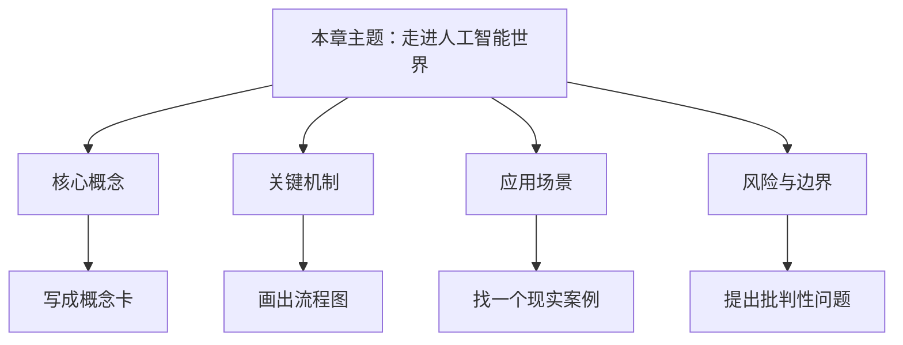

#### 5. 概念连接

相关概念：人工智能 AI, 生成式AI

请在精读时补充：

- 新增概念：
- 需要合并的概念：
- 与其他章节的连接：

#### 6. 批判性分析

| 评估维度           | 我的判断 |
| ------------------ | -------- |
| 作者默认前提       |          |
| 证据是否充分       |          |
| 类比是否准确       |          |
| 是否存在过度简化   |          |
| 与现实案例是否一致 |          |

#### 7. 费曼复述

请用 150-300 字向一个零基础读者解释本章：

> 待填写。

#### 8. 行动转化

- 我可以马上尝试的一个操作：
- 我可以在工作/学习中验证的一个观点：
- 我需要继续查证的一个问题：

#### 9. 间隔复习

- [ ] 阅读后 1 天：用 3 句话复述本章
- [ ] 阅读后 7 天：补齐概念卡与问题卡
- [ ] 阅读后 30 天：把本章纳入全书逻辑地图

---

### Ch02｜AI 核心概念速览

#### 1. 阅读前定位

**本章目的**：建立 AI、机器学习、深度学习、数据、算法、模型、训练、推理等基础词汇表。

**本章目录**：

- 智能的套娃
- 作为燃料的数据
- 算法：就是一张番茄炒蛋的菜谱
- 怎么训练？就像反复做题并订正

**阅读前自问**：

- 我对本章主题已有的理解是什么？
- 我希望通过本章解决哪个具体问题？
- 哪些概念可能是后续章节的基础？

#### 2. 主动阅读问题

- [ ] 为什么数据比算法更难复制？
- [ ] 模型黑盒会给医疗、金融、法律等领域带来什么风险？
- [ ] 正确率很高是否等于“理解”？

#### 3. 核心观点

- AI ⊃ 机器学习 ⊃ 深度学习，是愿景、手段与技术工具的包含关系。
- 数据决定模型上限，垃圾进垃圾出。
- 算法是菜谱，模型是用数据训练出的成品。
- 训练是反复做题并根据反馈更新参数；推理是使用训练好的模型。

#### 4. 逻辑重构

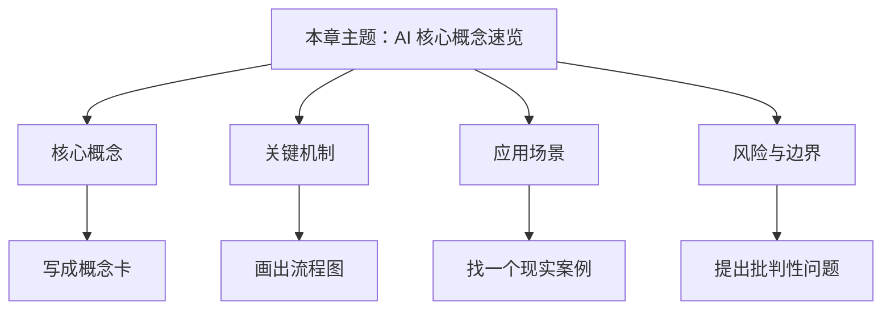

#### 5. 概念连接

相关概念：人工智能 AI, 机器学习 ML, 深度学习 DL, 数据, 算法, 模型, 训练, 推理

请在精读时补充：

- 新增概念：
- 需要合并的概念：
- 与其他章节的连接：

#### 6. 批判性分析

| 评估维度           | 我的判断 |
| ------------------ | -------- |
| 作者默认前提       |          |
| 证据是否充分       |          |
| 类比是否准确       |          |
| 是否存在过度简化   |          |
| 与现实案例是否一致 |          |

#### 7. 费曼复述

请用 150-300 字向一个零基础读者解释本章：

> 待填写。

#### 8. 行动转化

- 我可以马上尝试的一个操作：
- 我可以在工作/学习中验证的一个观点：
- 我需要继续查证的一个问题：

#### 9. 间隔复习

- [ ] 阅读后 1 天：用 3 句话复述本章
- [ ] 阅读后 7 天：补齐概念卡与问题卡
- [ ] 阅读后 30 天：把本章纳入全书逻辑地图

---

### Ch03｜AI 技术生态与工具全景

#### 1. 阅读前定位

**本章目的**：把 AI 行业拆成硬件、基础设施、框架、模型、应用与部署模式，建立工具选择地图。

**本章目录**：

- 盖房子的艺术
- 选云厂商就像选厨房
- 开源的盛宴：Hold 住你的 Hugging Face
- 中央厨房与自热火锅

**阅读前自问**：

- 我对本章主题已有的理解是什么？
- 我希望通过本章解决哪个具体问题？
- 哪些概念可能是后续章节的基础？

#### 2. 主动阅读问题

- [ ] 普通学习者应关注技术栈的哪一层？
- [ ] 为什么应用层机会多但竞争激烈？
- [ ] 如何判断一个 AI 工具是平台、框架、模型还是应用？

#### 3. 核心观点

- AI 技术栈可理解为从芯片到应用的层级结构。
- 云平台把模型能力、数据服务、部署与治理包装成服务。
- 开源生态降低了学习和开发门槛。
- 云端部署与边缘部署分别对应集中能力与本地低延迟/隐私需求。

#### 4. 逻辑重构

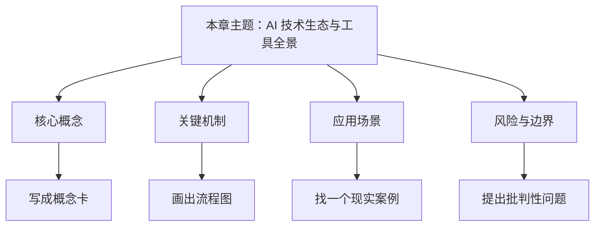

#### 5. 概念连接

相关概念：GPU TPU NPU, 模型, 推理

请在精读时补充：

- 新增概念：
- 需要合并的概念：
- 与其他章节的连接：

#### 6. 批判性分析

| 评估维度           | 我的判断 |
| ------------------ | -------- |
| 作者默认前提       |          |
| 证据是否充分       |          |
| 类比是否准确       |          |
| 是否存在过度简化   |          |
| 与现实案例是否一致 |          |

#### 7. 费曼复述

请用 150-300 字向一个零基础读者解释本章：

> 待填写。

#### 8. 行动转化

- 我可以马上尝试的一个操作：
- 我可以在工作/学习中验证的一个观点：
- 我需要继续查证的一个问题：

#### 9. 间隔复习

- [ ] 阅读后 1 天：用 3 句话复述本章
- [ ] 阅读后 7 天：补齐概念卡与问题卡
- [ ] 阅读后 30 天：把本章纳入全书逻辑地图

---

### Ch04｜机器学习原理

#### 1. 阅读前定位

**本章目的**：理解机器学习如何从样本中归纳规律，以及不同学习范式适合解决什么问题。

**本章目录**：

- 归纳法与机器学习
- 监督学习
- 无监督学习
- 强化学习
- 强化学习的真实场景与挑战
- 自监督学习

**阅读前自问**：

- 我对本章主题已有的理解是什么？
- 我希望通过本章解决哪个具体问题？
- 哪些概念可能是后续章节的基础？

#### 2. 主动阅读问题

- [ ] 什么问题必须有标签才能解决？
- [ ] 什么场景适合让模型自己发现结构？
- [ ] 强化学习为什么在现实世界中比游戏环境更困难？

#### 3. 核心观点

- 监督学习依赖带标签样本，适合分类和预测。
- 无监督学习寻找数据中的结构，适合聚类、降维与模式发现。
- 强化学习通过奖励信号学习策略，但真实世界成本与安全约束很高。
- 自监督学习让模型从数据本身构造训练信号，是大模型预训练的重要基础。

#### 4. 逻辑重构


#### 5. 概念连接

相关概念：机器学习 ML, 监督学习, 无监督学习, 强化学习, 自监督学习

请在精读时补充：

- 新增概念：
- 需要合并的概念：
- 与其他章节的连接：

#### 6. 批判性分析

| 评估维度           | 我的判断 |
| ------------------ | -------- |
| 作者默认前提       |          |
| 证据是否充分       |          |
| 类比是否准确       |          |
| 是否存在过度简化   |          |
| 与现实案例是否一致 |          |

#### 7. 费曼复述

请用 150-300 字向一个零基础读者解释本章：

> 待填写。

#### 8. 行动转化

- 我可以马上尝试的一个操作：
- 我可以在工作/学习中验证的一个观点：
- 我需要继续查证的一个问题：

#### 9. 间隔复习

- [ ] 阅读后 1 天：用 3 句话复述本章
- [ ] 阅读后 7 天：补齐概念卡与问题卡
- [ ] 阅读后 30 天：把本章纳入全书逻辑地图

---

### Ch05｜深度学习揭秘

#### 1. 阅读前定位

**本章目的**：把神经网络看作可学习的函数逼近器，理解深度学习的能力边界与局限。

**本章目录**：

- 神经网络
- 深度学习训练
- 深度学习架构
- 深度学习的局限性
- 数学直觉：理解神经网络的灵魂（可选）

**阅读前自问**：

- 我对本章主题已有的理解是什么？
- 我希望通过本章解决哪个具体问题？
- 哪些概念可能是后续章节的基础？

#### 2. 主动阅读问题

- [ ] “自动提取特征”为什么是革命性变化？
- [ ] 更深更大的模型一定更好吗？
- [ ] 黑盒模型在高风险领域应如何被约束？

#### 3. 核心观点

- 神经网络通过层级表示自动提取特征。
- 深度学习的能力依赖数据、算力、架构与优化过程。
- CNN、RNN、Transformer 等架构对应不同数据结构与任务。
- 局限包括黑盒性、数据依赖、幻觉、泛化不足和资源消耗。

#### 4. 逻辑重构

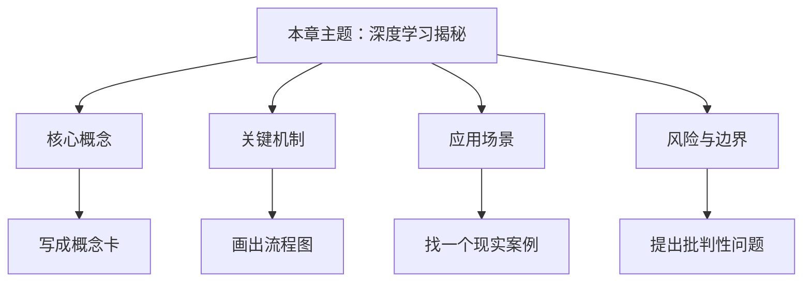

#### 5. 概念连接

相关概念：深度学习 DL, 神经网络, 损失函数

请在精读时补充：

- 新增概念：
- 需要合并的概念：
- 与其他章节的连接：

#### 6. 批判性分析

| 评估维度           | 我的判断 |
| ------------------ | -------- |
| 作者默认前提       |          |
| 证据是否充分       |          |
| 类比是否准确       |          |
| 是否存在过度简化   |          |
| 与现实案例是否一致 |          |

#### 7. 费曼复述

请用 150-300 字向一个零基础读者解释本章：

> 待填写。

#### 8. 行动转化

- 我可以马上尝试的一个操作：
- 我可以在工作/学习中验证的一个观点：
- 我需要继续查证的一个问题：

#### 9. 间隔复习

- [ ] 阅读后 1 天：用 3 句话复述本章
- [ ] 阅读后 7 天：补齐概念卡与问题卡
- [ ] 阅读后 30 天：把本章纳入全书逻辑地图

---

### Ch06｜大语言模型详解

#### 1. 阅读前定位

**本章目的**：理解 LLM 为什么能处理语言、代码与知识任务，以及 Transformer、预训练、微调和推理部署的关系。

**本章目录**：

- 语言模型演变
- 大模型原理
- Transformer 的注意力机制详解
- 预训练与微调
- 主流大模型
- 大模型的部署与推理：让模型跑起来

**阅读前自问**：

- 我对本章主题已有的理解是什么？
- 我希望通过本章解决哪个具体问题？
- 哪些概念可能是后续章节的基础？

#### 2. 主动阅读问题

- [ ] LLM 是记忆知识还是生成概率？
- [ ] 注意力机制为什么适合长文本建模？
- [ ] 开源模型与闭源模型的取舍标准是什么？

#### 3. 核心观点

- 语言模型本质上学习 token 序列中的概率结构。
- Transformer 的注意力机制让模型在上下文中动态关注相关信息。
- 预训练获得通用能力，微调/对齐让模型适应任务和人类偏好。
- 部署与推理涉及成本、延迟、上下文长度、量化和服务架构。

#### 4. 逻辑重构

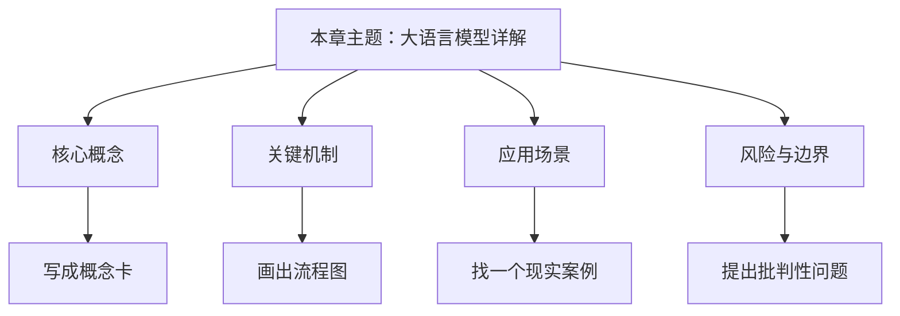

#### 5. 概念连接

相关概念：大语言模型 LLM, Transformer, 注意力机制, 预训练, 微调

请在精读时补充：

- 新增概念：
- 需要合并的概念：
- 与其他章节的连接：

#### 6. 批判性分析

| 评估维度           | 我的判断 |
| ------------------ | -------- |
| 作者默认前提       |          |
| 证据是否充分       |          |
| 类比是否准确       |          |
| 是否存在过度简化   |          |
| 与现实案例是否一致 |          |

#### 7. 费曼复述

请用 150-300 字向一个零基础读者解释本章：

> 待填写。

#### 8. 行动转化

- 我可以马上尝试的一个操作：
- 我可以在工作/学习中验证的一个观点：
- 我需要继续查证的一个问题：

#### 9. 间隔复习

- [ ] 阅读后 1 天：用 3 句话复述本章
- [ ] 阅读后 7 天：补齐概念卡与问题卡
- [ ] 阅读后 30 天：把本章纳入全书逻辑地图

---

### Ch07｜推理模型与推理计算

#### 1. 阅读前定位

**本章目的**：理解从快速回答到显式推理的范式变化，以及推理能力带来的成本、延迟和可靠性权衡。

**本章目录**：

- 两种思维方式：System 1 vs System 2
- 推理模型的工作原理
- 推理计算：新的AI范式
- 主流推理模型深度对比
- 推理模型的局限与成本

**阅读前自问**：

- 我对本章主题已有的理解是什么？
- 我希望通过本章解决哪个具体问题？
- 哪些概念可能是后续章节的基础？

#### 2. 主动阅读问题

- [ ] 什么时候需要推理模型，什么时候不需要？
- [ ] 更长推理是否一定更正确？
- [ ] 推理过程可见性与答案可靠性之间是什么关系？

#### 3. 核心观点

- 推理模型更强调分步骤解决复杂问题。
- 推理计算把测试时计算资源转化为更高质量答案。
- “慢思考”适合数学、代码、规划、复杂分析等任务。
- 推理模型的代价是更高成本、更长等待时间和仍然存在的错误。

#### 4. 逻辑重构


#### 5. 概念连接

相关概念：推理, 大语言模型 LLM

请在精读时补充：

- 新增概念：
- 需要合并的概念：
- 与其他章节的连接：

#### 6. 批判性分析

| 评估维度           | 我的判断 |
| ------------------ | -------- |
| 作者默认前提       |          |
| 证据是否充分       |          |
| 类比是否准确       |          |
| 是否存在过度简化   |          |
| 与现实案例是否一致 |          |

#### 7. 费曼复述

请用 150-300 字向一个零基础读者解释本章：

> 待填写。

#### 8. 行动转化

- 我可以马上尝试的一个操作：
- 我可以在工作/学习中验证的一个观点：
- 我需要继续查证的一个问题：

#### 9. 间隔复习

- [ ] 阅读后 1 天：用 3 句话复述本章
- [ ] 阅读后 7 天：补齐概念卡与问题卡
- [ ] 阅读后 30 天：把本章纳入全书逻辑地图

---

### Ch08｜新架构与创新案例

#### 1. 阅读前定位

**本章目的**：从 Transformer 的扩展瓶颈进入新架构、长上下文、MoE、MLA 与推理模型创新。

**本章目录**：

- Transformer 的二次复杂度
- 状态空间模型入门
- 混合架构的未来：Jamba、Bamba、Titans
- 长上下文与持久记忆
- DeepSeek 是什么
- DeepSeek 的技术创新：MLA 和 MoE
- DeepSeek-R1：推理模型的黑马

**阅读前自问**：

- 我对本章主题已有的理解是什么？
- 我希望通过本章解决哪个具体问题？
- 哪些概念可能是后续章节的基础？

#### 2. 主动阅读问题

- [ ] 长上下文能否替代 RAG？
- [ ] MoE 的效率优势来自哪里？
- [ ] 新架构是替代 Transformer，还是与其形成混合系统？

#### 3. 核心观点

- Transformer 的注意力计算存在随序列长度增长的成本问题。
- 状态空间模型和混合架构试图提升长序列建模效率。
- 长上下文与持久记忆改变了 AI 与知识库、工作流和个人数据的关系。
- DeepSeek 案例展示了架构、训练策略和成本效率创新的重要性。

#### 4. 逻辑重构


#### 5. 概念连接

相关概念：Transformer, 长上下文, MoE, MLA

请在精读时补充：

- 新增概念：
- 需要合并的概念：
- 与其他章节的连接：

#### 6. 批判性分析

| 评估维度           | 我的判断 |
| ------------------ | -------- |
| 作者默认前提       |          |
| 证据是否充分       |          |
| 类比是否准确       |          |
| 是否存在过度简化   |          |
| 与现实案例是否一致 |          |

#### 7. 费曼复述

请用 150-300 字向一个零基础读者解释本章：

> 待填写。

#### 8. 行动转化

- 我可以马上尝试的一个操作：
- 我可以在工作/学习中验证的一个观点：
- 我需要继续查证的一个问题：

#### 9. 间隔复习

- [ ] 阅读后 1 天：用 3 句话复述本章
- [ ] 阅读后 7 天：补齐概念卡与问题卡
- [ ] 阅读后 30 天：把本章纳入全书逻辑地图

---

### Ch09｜多模态与生成式 AI

#### 1. 阅读前定位

**本章目的**：理解 AI 从文本走向图像、音频、视频和现实世界行动的路径。

**本章目录**：

- 多模态学习
- 图像生成与扩散模型
- 视频与音频生成
- 原生全模态与具身智能

**阅读前自问**：

- 我对本章主题已有的理解是什么？
- 我希望通过本章解决哪个具体问题？
- 哪些概念可能是后续章节的基础？

#### 2. 主动阅读问题

- [ ] 多模态模型是在“理解”世界，还是在对齐数据分布？
- [ ] 生成式内容如何改变创意行业成本结构？
- [ ] 具身智能离通用机器人还有哪些障碍？

#### 3. 核心观点

- 多模态学习让模型在不同信息形式之间建立对齐。
- 扩散模型是图像生成的重要路线。
- 视频和音频生成提高了内容生产能力，也放大了真实性验证问题。
- 全模态与具身智能把感知、语言、行动连接起来。

#### 4. 逻辑重构

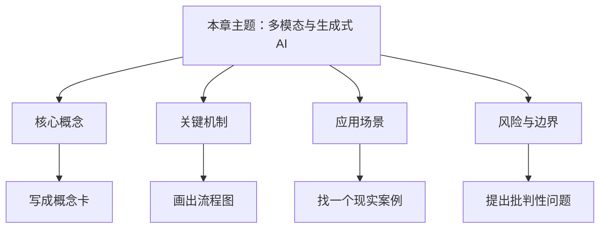

#### 5. 概念连接

相关概念：多模态, 扩散模型, 生成式AI

请在精读时补充：

- 新增概念：
- 需要合并的概念：
- 与其他章节的连接：

#### 6. 批判性分析

| 评估维度           | 我的判断 |
| ------------------ | -------- |
| 作者默认前提       |          |
| 证据是否充分       |          |
| 类比是否准确       |          |
| 是否存在过度简化   |          |
| 与现实案例是否一致 |          |

#### 7. 费曼复述

请用 150-300 字向一个零基础读者解释本章：

> 待填写。

#### 8. 行动转化

- 我可以马上尝试的一个操作：
- 我可以在工作/学习中验证的一个观点：
- 我需要继续查证的一个问题：

#### 9. 间隔复习

- [ ] 阅读后 1 天：用 3 句话复述本章
- [ ] 阅读后 7 天：补齐概念卡与问题卡
- [ ] 阅读后 30 天：把本章纳入全书逻辑地图

---

### Ch10｜主流 AI 工具使用指南

#### 1. 阅读前定位

**本章目的**：从工具能力、适用场景和选择标准理解主流 AI 产品。

**本章目录**：

- ChatGPT
- Claude
- Gemini
- 国产 AI 工具
- 垂直领域工具

**阅读前自问**：

- 我对本章主题已有的理解是什么？
- 我希望通过本章解决哪个具体问题？
- 哪些概念可能是后续章节的基础？

#### 2. 主动阅读问题

- [ ] 怎样评估一个 AI 工具是否适合你的工作？
- [ ] 为什么同一提示词在不同模型上表现不同？
- [ ] 通用模型和垂直工具如何组合？

#### 3. 核心观点

- 不同模型和工具的强项不同，应按任务而非名气选择。
- 通用对话工具适合写作、问答、分析、代码等场景。
- 垂直工具通常在特定工作流中更高效。
- 工具使用能力本质上是任务拆解、上下文组织与结果校验能力。

#### 4. 逻辑重构


#### 5. 概念连接

相关概念：大语言模型 LLM, 提示词工程

请在精读时补充：

- 新增概念：
- 需要合并的概念：
- 与其他章节的连接：

#### 6. 批判性分析

| 评估维度           | 我的判断 |
| ------------------ | -------- |
| 作者默认前提       |          |
| 证据是否充分       |          |
| 类比是否准确       |          |
| 是否存在过度简化   |          |
| 与现实案例是否一致 |          |

#### 7. 费曼复述

请用 150-300 字向一个零基础读者解释本章：

> 待填写。

#### 8. 行动转化

- 我可以马上尝试的一个操作：
- 我可以在工作/学习中验证的一个观点：
- 我需要继续查证的一个问题：

#### 9. 间隔复习

- [ ] 阅读后 1 天：用 3 句话复述本章
- [ ] 阅读后 7 天：补齐概念卡与问题卡
- [ ] 阅读后 30 天：把本章纳入全书逻辑地图

---

### Ch11｜提示词工程入门

#### 1. 阅读前定位

**本章目的**：把提示词从“写咒语”还原为任务说明、上下文提供、输出约束与迭代校验。

**本章目录**：

- 提示词工程简介
- 提示词黄金三原则
- 常用提示词模式
- 常见错误清单
- 提示词工程的失效边界

**阅读前自问**：

- 我对本章主题已有的理解是什么？
- 我希望通过本章解决哪个具体问题？
- 哪些概念可能是后续章节的基础？

#### 2. 主动阅读问题

- [ ] 提示词为什么不是越长越好？
- [ ] 怎样区分提示词问题和模型能力问题？
- [ ] 哪些任务不能只靠提示词解决？

#### 3. 核心观点

- 好提示词要明确角色、任务、上下文、标准与输出格式。
- 提示词模式可复用，但必须服务于具体任务。
- 常见错误包括目标模糊、缺少上下文、没有验收标准、一次性要求过多。
- 提示词工程有边界，不能替代数据、工具、系统集成和人工判断。

#### 4. 逻辑重构


#### 5. 概念连接

相关概念：提示词工程, 上下文工程

请在精读时补充：

- 新增概念：
- 需要合并的概念：
- 与其他章节的连接：

#### 6. 批判性分析

| 评估维度           | 我的判断 |
| ------------------ | -------- |
| 作者默认前提       |          |
| 证据是否充分       |          |
| 类比是否准确       |          |
| 是否存在过度简化   |          |
| 与现实案例是否一致 |          |

#### 7. 费曼复述

请用 150-300 字向一个零基础读者解释本章：

> 待填写。

#### 8. 行动转化

- 我可以马上尝试的一个操作：
- 我可以在工作/学习中验证的一个观点：
- 我需要继续查证的一个问题：

#### 9. 间隔复习

- [ ] 阅读后 1 天：用 3 句话复述本章
- [ ] 阅读后 7 天：补齐概念卡与问题卡
- [ ] 阅读后 30 天：把本章纳入全书逻辑地图

---

### Ch12｜提示词工程进阶与上下文工程

#### 1. 阅读前定位

**本章目的**：从单次提示词升级为上下文、知识库、系统集成与迭代工作流设计。

**本章目录**：

- 思维链
- 结构化输出
- 迭代优化
- 高级提示词技巧
- 上下文工程：AI 时代的基本素养

**阅读前自问**：

- 我对本章主题已有的理解是什么？
- 我希望通过本章解决哪个具体问题？
- 哪些概念可能是后续章节的基础？

#### 2. 主动阅读问题

- [ ] 为什么“上下文 > 提示词”？
- [ ] RAG 解决的到底是什么问题？
- [ ] 什么时候该把任务从聊天升级为系统？

#### 3. 核心观点

- 结构化输出提高可控性与可验证性。
- 迭代优化比一次性追求完美更可靠。
- 上下文工程强调给 AI 足够的背景、资料、工具状态与约束。
- 上下文可分为对话历史、知识库和系统集成三个层次。

#### 4. 逻辑重构

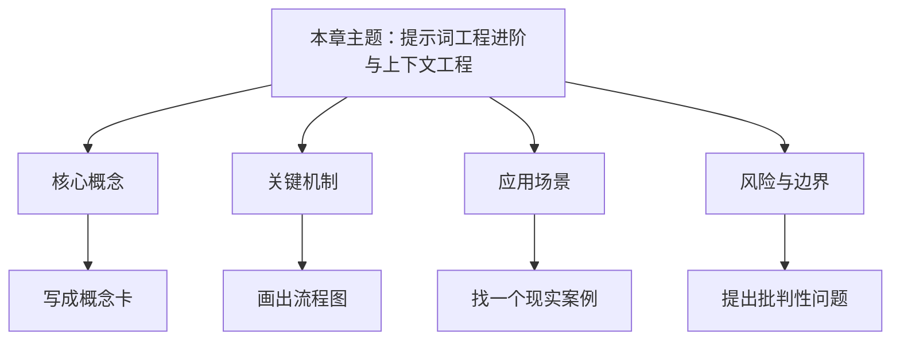

#### 5. 概念连接

相关概念：上下文工程, RAG, MCP, 提示词工程

请在精读时补充：

- 新增概念：
- 需要合并的概念：
- 与其他章节的连接：

#### 6. 批判性分析

| 评估维度           | 我的判断 |
| ------------------ | -------- |
| 作者默认前提       |          |
| 证据是否充分       |          |
| 类比是否准确       |          |
| 是否存在过度简化   |          |
| 与现实案例是否一致 |          |

#### 7. 费曼复述

请用 150-300 字向一个零基础读者解释本章：

> 待填写。

#### 8. 行动转化

- 我可以马上尝试的一个操作：
- 我可以在工作/学习中验证的一个观点：
- 我需要继续查证的一个问题：

#### 9. 间隔复习

- [ ] 阅读后 1 天：用 3 句话复述本章
- [ ] 阅读后 7 天：补齐概念卡与问题卡
- [ ] 阅读后 30 天：把本章纳入全书逻辑地图

---

### Ch13｜AI 实战应用场景

#### 1. 阅读前定位

**本章目的**：把前面的技术概念映射到真实工作、学习、编程、生活和行业应用。

**本章目录**：

- 职场应用
- 学习助手
- 编程助手
- 生活助手
- AI 在非技术行业的应用
- 深度思考：人类工作的未来

**阅读前自问**：

- 我对本章主题已有的理解是什么？
- 我希望通过本章解决哪个具体问题？
- 哪些概念可能是后续章节的基础？

#### 2. 主动阅读问题

- [ ] 哪些工作任务适合 AI 增强而非替代？
- [ ] 你能否把自己的工作拆成“输入-处理-输出-验收”？
- [ ] AI 提升效率后，人类差异化价值在哪里？

#### 3. 核心观点

- AI 的价值通常来自降低搜索、沟通、生成、分析和决策成本。
- 学习助手的关键是反馈、解释和个性化路径。
- 编程助手改变的是从写代码到设计、调试和评审的工作流。
- 非技术行业的应用必须考虑专业责任、数据隐私和错误成本。

#### 4. 逻辑重构

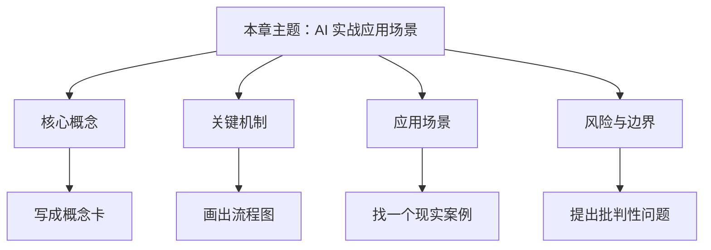

#### 5. 概念连接

相关概念：生成式AI, 智能体 Agent, 上下文工程

请在精读时补充：

- 新增概念：
- 需要合并的概念：
- 与其他章节的连接：

#### 6. 批判性分析

| 评估维度           | 我的判断 |
| ------------------ | -------- |
| 作者默认前提       |          |
| 证据是否充分       |          |
| 类比是否准确       |          |
| 是否存在过度简化   |          |
| 与现实案例是否一致 |          |

#### 7. 费曼复述

请用 150-300 字向一个零基础读者解释本章：

> 待填写。

#### 8. 行动转化

- 我可以马上尝试的一个操作：
- 我可以在工作/学习中验证的一个观点：
- 我需要继续查证的一个问题：

#### 9. 间隔复习

- [ ] 阅读后 1 天：用 3 句话复述本章
- [ ] 阅读后 7 天：补齐概念卡与问题卡
- [ ] 阅读后 30 天：把本章纳入全书逻辑地图

---

### Ch14｜AI 智能体与多智能体系统

#### 1. 阅读前定位

**本章目的**：理解智能体从“聊天回答”走向“目标、规划、工具调用、记忆和协作”的系统形态。

**本章目录**：

- 什么是智能体
- 智能体是如何工作的
- 低代码智能体开发平台
- 多智能体协作系统：从独奏到交响乐

**阅读前自问**：

- 我对本章主题已有的理解是什么？
- 我希望通过本章解决哪个具体问题？
- 哪些概念可能是后续章节的基础？

#### 2. 主动阅读问题

- [ ] 什么任务值得做成智能体？
- [ ] 多智能体是必要架构还是复杂度膨胀？
- [ ] 如何设计人类审批节点以降低风险？

#### 3. 核心观点

- 智能体通常由目标、模型、工具、记忆、规划和反馈构成。
- 工具调用让模型从生成文本转为执行动作。
- 多智能体系统通过分工、协作、评审和调度处理复杂任务。
- 智能体系统的关键约束是成本、可靠性、安全边界和可观测性。

#### 4. 逻辑重构


#### 5. 概念连接

相关概念：智能体 Agent, 多智能体, MCP

请在精读时补充：

- 新增概念：
- 需要合并的概念：
- 与其他章节的连接：

#### 6. 批判性分析

| 评估维度           | 我的判断 |
| ------------------ | -------- |
| 作者默认前提       |          |
| 证据是否充分       |          |
| 类比是否准确       |          |
| 是否存在过度简化   |          |
| 与现实案例是否一致 |          |

#### 7. 费曼复述

请用 150-300 字向一个零基础读者解释本章：

> 待填写。

#### 8. 行动转化

- 我可以马上尝试的一个操作：
- 我可以在工作/学习中验证的一个观点：
- 我需要继续查证的一个问题：

#### 9. 间隔复习

- [ ] 阅读后 1 天：用 3 句话复述本章
- [ ] 阅读后 7 天：补齐概念卡与问题卡
- [ ] 阅读后 30 天：把本章纳入全书逻辑地图

---

### Ch15｜AI 伦理、安全与未来

#### 1. 阅读前定位

**本章目的**：讨论 AI 系统的社会风险、责任边界、就业影响和通用智能前景。

**本章目录**：

- AI 的偏见与伦理
- 安全与隐私挑战
- AI 对就业的影响
- 迈向 AGI

**阅读前自问**：

- 我对本章主题已有的理解是什么？
- 我希望通过本章解决哪个具体问题？
- 哪些概念可能是后续章节的基础？

#### 2. 主动阅读问题

- [ ] 谁对 AI 错误负责？
- [ ] 效率提升是否必然带来公平改善？
- [ ] 面对 AGI 叙事，如何避免恐慌和盲目乐观？

#### 3. 核心观点

- AI 偏见往往来自数据、目标函数、部署环境和反馈循环。
- 隐私、安全与滥用风险必须进入设计阶段，而不是上线后补救。
- 就业影响不是单纯替代，而是任务结构、技能价值和组织流程的再分配。
- AGI 仍是开放问题，需要区分能力展示、可靠性和自主性。

#### 4. 逻辑重构

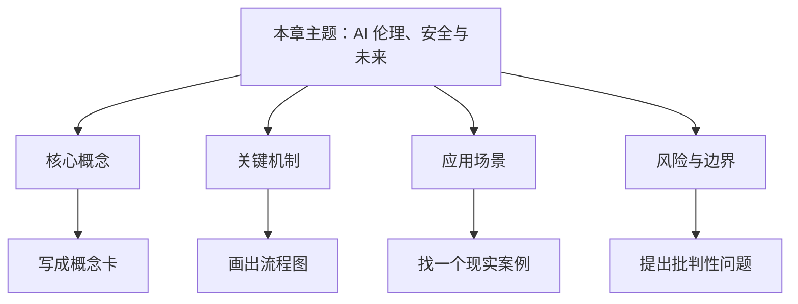

#### 5. 概念连接

相关概念：AI伦理, 人工智能 AI

请在精读时补充：

- 新增概念：
- 需要合并的概念：
- 与其他章节的连接：

#### 6. 批判性分析

| 评估维度           | 我的判断 |
| ------------------ | -------- |
| 作者默认前提       |          |
| 证据是否充分       |          |
| 类比是否准确       |          |
| 是否存在过度简化   |          |
| 与现实案例是否一致 |          |

#### 7. 费曼复述

请用 150-300 字向一个零基础读者解释本章：

> 待填写。

#### 8. 行动转化

- 我可以马上尝试的一个操作：
- 我可以在工作/学习中验证的一个观点：
- 我需要继续查证的一个问题：

#### 9. 间隔复习

- [ ] 阅读后 1 天：用 3 句话复述本章
- [ ] 阅读后 7 天：补齐概念卡与问题卡
- [ ] 阅读后 30 天：把本章纳入全书逻辑地图

---

### Ch16｜AI 硬件与量子计算入门

#### 1. 阅读前定位

**本章目的**：理解硬件如何约束 AI 能力、成本和部署形态，并建立对量子计算与 AI 关系的清醒预期。

**本章目录**：

- AI 芯片基础：GPU、TPU、NPU
- 量子计算与 AI 的未来

**阅读前自问**：

- 我对本章主题已有的理解是什么？
- 我希望通过本章解决哪个具体问题？
- 哪些概念可能是后续章节的基础？

#### 2. 主动阅读问题

- [ ] 算力瓶颈如何影响模型发展？
- [ ] 边缘 AI 与云端 AI 的边界在哪里？
- [ ] 量子计算在 AI 中最现实的近期价值是什么？

#### 3. 核心观点

- GPU、TPU、NPU 对应不同的训练/推理和场景需求。
- AI 推理的硬件选择要看成本、吞吐、延迟、功耗和部署位置。
- 量子计算可能影响部分优化、模拟和加速问题，但不会简单取代 AI。
- 硬件进步会反向塑造模型架构和商业模式。

#### 4. 逻辑重构


#### 5. 概念连接

相关概念：GPU TPU NPU, 推理, 训练

请在精读时补充：

- 新增概念：
- 需要合并的概念：
- 与其他章节的连接：

#### 6. 批判性分析

| 评估维度           | 我的判断 |
| ------------------ | -------- |
| 作者默认前提       |          |
| 证据是否充分       |          |
| 类比是否准确       |          |
| 是否存在过度简化   |          |
| 与现实案例是否一致 |          |

#### 7. 费曼复述

请用 150-300 字向一个零基础读者解释本章：

> 待填写。

#### 8. 行动转化

- 我可以马上尝试的一个操作：
- 我可以在工作/学习中验证的一个观点：
- 我需要继续查证的一个问题：

#### 9. 间隔复习

- [ ] 阅读后 1 天：用 3 句话复述本章
- [ ] 阅读后 7 天：补齐概念卡与问题卡
- [ ] 阅读后 30 天：把本章纳入全书逻辑地图

---

## 核心概念卡片

### AI伦理

#### 定义

围绕偏见、公平、透明、责任、隐私和社会影响的治理问题。

#### 用自己的话说

不能只问“能不能做”，还要问“应不应该做、谁负责”。

#### 关键判断

- 它解决什么问题：
- 它依赖什么条件：
- 它容易被误解为什么：
- 它和现实应用的连接：

#### 相关概念

- 偏见
- 隐私
- 安全

#### 费曼解释

> 用一个生活类比解释这个概念。

#### 例子

- 原书例子：
- 我的例子：

#### 待验证问题

- [ ]

---

### GPU TPU NPU

#### 定义

不同类型的 AI 加速硬件，分别适合训练、推理或边缘设备等场景。

#### 用自己的话说

硬件决定模型成本、速度和可部署范围。

#### 关键判断

- 它解决什么问题：
- 它依赖什么条件：
- 它容易被误解为什么：
- 它和现实应用的连接：

#### 相关概念

- AI硬件
- 推理
- 训练

#### 费曼解释

> 用一个生活类比解释这个概念。

#### 例子

- 原书例子：
- 我的例子：

#### 待验证问题

- [ ]

---

### MCP

#### 定义

模型上下文协议，用于让模型连接外部工具、数据源和系统能力。

#### 用自己的话说

关注的是系统集成，不只是聊天提示。

#### 关键判断

- 它解决什么问题：
- 它依赖什么条件：
- 它容易被误解为什么：
- 它和现实应用的连接：

#### 相关概念

- 上下文工程
- 智能体 Agent
- 工具调用

#### 费曼解释

> 用一个生活类比解释这个概念。

#### 例子

- 原书例子：
- 我的例子：

#### 待验证问题

- [ ]

---

### MLA

#### 定义

多头潜在注意力等注意力优化思路，用于降低 KV 缓存和推理成本。

#### 用自己的话说

常见于新一代高效率 LLM 架构讨论。

#### 关键判断

- 它解决什么问题：
- 它依赖什么条件：
- 它容易被误解为什么：
- 它和现实应用的连接：

#### 相关概念

- DeepSeek
- 注意力机制
- 推理成本

#### 费曼解释

> 用一个生活类比解释这个概念。

#### 例子

- 原书例子：
- 我的例子：

#### 待验证问题

- [ ]

---

### MoE

#### 定义

Mixture of Experts，混合专家架构；每次只激活部分专家以提高参数效率。

#### 用自己的话说

核心价值是用较低推理成本获得较大模型容量。

#### 关键判断

- 它解决什么问题：
- 它依赖什么条件：
- 它容易被误解为什么：
- 它和现实应用的连接：

#### 相关概念

- DeepSeek
- 大语言模型 LLM
- 推理成本

#### 费曼解释

> 用一个生活类比解释这个概念。

#### 例子

- 原书例子：
- 我的例子：

#### 待验证问题

- [ ]

---

### RAG

#### 定义

检索增强生成：先从知识库检索相关资料，再让模型基于资料生成答案。

#### 用自己的话说

适合解决知识更新、私有知识和可追溯引用问题。

#### 关键判断

- 它解决什么问题：
- 它依赖什么条件：
- 它容易被误解为什么：
- 它和现实应用的连接：

#### 相关概念

- 上下文工程
- 向量数据库
- 知识库

#### 费曼解释

> 用一个生活类比解释这个概念。

#### 例子

- 原书例子：
- 我的例子：

#### 待验证问题

- [ ]

---

### Transformer

#### 定义

以注意力机制为核心的深度学习架构，支撑现代大语言模型。

#### 用自己的话说

优势是并行处理和上下文建模；挑战是长序列计算成本。

#### 关键判断

- 它解决什么问题：
- 它依赖什么条件：
- 它容易被误解为什么：
- 它和现实应用的连接：

#### 相关概念

- 注意力机制
- 大语言模型 LLM
- 长上下文

#### 费曼解释

> 用一个生活类比解释这个概念。

#### 例子

- 原书例子：
- 我的例子：

#### 待验证问题

- [ ]

---

### 上下文工程

#### 定义

系统性组织对话历史、知识库、工具状态和外部系统信息，使 AI 能完成真实任务。

#### 用自己的话说

比单次提示词更接近 AI 系统设计。

#### 关键判断

- 它解决什么问题：
- 它依赖什么条件：
- 它容易被误解为什么：
- 它和现实应用的连接：

#### 相关概念

- RAG
- MCP
- 智能体 Agent
- 提示词工程

#### 费曼解释

> 用一个生活类比解释这个概念。

#### 例子

- 原书例子：
- 我的例子：

#### 待验证问题

- [ ]

---

### 人工智能 AI

#### 定义

让机器表现出学习、推理、感知、生成、决策等智能行为的技术总称。

#### 用自己的话说

不要把 AI 简化成“会聊天的工具”；它也包括推荐、识别、风控、调度等隐形系统。

#### 关键判断

- 它解决什么问题：
- 它依赖什么条件：
- 它容易被误解为什么：
- 它和现实应用的连接：

#### 相关概念

- 机器学习 ML
- 深度学习 DL
- 生成式AI
- 弱人工智能

#### 费曼解释

> 用一个生活类比解释这个概念。

#### 例子

- 原书例子：
- 我的例子：

#### 待验证问题

- [ ]

---

### 多智能体

#### 定义

多个智能体通过分工、协作、评审或竞争完成复杂任务的系统。

#### 用自己的话说

复杂任务可分解，但也会带来协调成本和错误传播。

#### 关键判断

- 它解决什么问题：
- 它依赖什么条件：
- 它容易被误解为什么：
- 它和现实应用的连接：

#### 相关概念

- 智能体 Agent
- 协作模式
- 可观测性

#### 费曼解释

> 用一个生活类比解释这个概念。

#### 例子

- 原书例子：
- 我的例子：

#### 待验证问题

- [ ]

---

### 多模态

#### 定义

同时处理并对齐文本、图像、音频、视频等不同信息形式的能力。

#### 用自己的话说

核心不是简单输入多种文件，而是在模态之间建立可迁移的表示。

#### 关键判断

- 它解决什么问题：
- 它依赖什么条件：
- 它容易被误解为什么：
- 它和现实应用的连接：

#### 相关概念

- 生成式AI
- 扩散模型
- 具身智能

#### 费曼解释

> 用一个生活类比解释这个概念。

#### 例子

- 原书例子：
- 我的例子：

#### 待验证问题

- [ ]

---

### 大语言模型 LLM

#### 定义

在大规模语料上训练、能理解和生成自然语言及代码的模型。

#### 用自己的话说

其能力来自规模、数据、架构、预训练和对齐。

#### 关键判断

- 它解决什么问题：
- 它依赖什么条件：
- 它容易被误解为什么：
- 它和现实应用的连接：

#### 相关概念

- Transformer
- 预训练
- 微调
- 提示词工程

#### 费曼解释

> 用一个生活类比解释这个概念。

#### 例子

- 原书例子：
- 我的例子：

#### 待验证问题

- [ ]

---

### 强化学习

#### 定义

智能体通过行动、奖励和环境反馈学习策略。

#### 用自己的话说

适合序列决策，但真实世界实验成本和安全风险很高。

#### 关键判断

- 它解决什么问题：
- 它依赖什么条件：
- 它容易被误解为什么：
- 它和现实应用的连接：

#### 相关概念

- 智能体 Agent
- 奖励函数
- 策略

#### 费曼解释

> 用一个生活类比解释这个概念。

#### 例子

- 原书例子：
- 我的例子：

#### 待验证问题

- [ ]

---

### 微调

#### 定义

在特定数据或任务上继续训练模型，使其适应特定场景。

#### 用自己的话说

适合稳定、高频、有数据的任务；不是所有场景都需要微调。

#### 关键判断

- 它解决什么问题：
- 它依赖什么条件：
- 它容易被误解为什么：
- 它和现实应用的连接：

#### 相关概念

- 预训练
- 对齐
- RAG

#### 费曼解释

> 用一个生活类比解释这个概念。

#### 例子

- 原书例子：
- 我的例子：

#### 待验证问题

- [ ]

---

### 扩散模型

#### 定义

通过逐步去噪生成图像等内容的生成模型路线。

#### 用自己的话说

可理解为从噪声中一步步还原出符合提示的图像。

#### 关键判断

- 它解决什么问题：
- 它依赖什么条件：
- 它容易被误解为什么：
- 它和现实应用的连接：

#### 相关概念

- 图像生成
- 生成式AI
- 多模态

#### 费曼解释

> 用一个生活类比解释这个概念。

#### 例子

- 原书例子：
- 我的例子：

#### 待验证问题

- [ ]

---

### 损失函数

#### 定义

衡量模型预测与目标答案差距的函数。

#### 用自己的话说

模型优化的核心目标通常是降低损失。

#### 关键判断

- 它解决什么问题：
- 它依赖什么条件：
- 它容易被误解为什么：
- 它和现实应用的连接：

#### 相关概念

- 训练
- 优化
- 梯度下降

#### 费曼解释

> 用一个生活类比解释这个概念。

#### 例子

- 原书例子：
- 我的例子：

#### 待验证问题

- [ ]

---

### 推理

#### 定义

使用训练好的模型处理新输入并产生输出。

#### 用自己的话说

训练像造发动机，推理像开车；用户大多接触的是推理阶段。

#### 关键判断

- 它解决什么问题：
- 它依赖什么条件：
- 它容易被误解为什么：
- 它和现实应用的连接：

#### 相关概念

- 训练
- 部署
- 推理计算

#### 费曼解释

> 用一个生活类比解释这个概念。

#### 例子

- 原书例子：
- 我的例子：

#### 待验证问题

- [ ]

---

### 提示词工程

#### 定义

通过清晰任务、上下文、约束和输出格式来引导模型输出。

#### 用自己的话说

它是任务说明技术，不是魔法咒语。

#### 关键判断

- 它解决什么问题：
- 它依赖什么条件：
- 它容易被误解为什么：
- 它和现实应用的连接：

#### 相关概念

- 上下文工程
- 结构化输出
- 迭代优化

#### 费曼解释

> 用一个生活类比解释这个概念。

#### 例子

- 原书例子：
- 我的例子：

#### 待验证问题

- [ ]

---

### 数据

#### 定义

AI 训练的原料，质量、规模、覆盖范围和标注方式决定模型能力边界。

#### 用自己的话说

数据不是越多越好；高质量、任务相关、低噪声的数据更关键。

#### 关键判断

- 它解决什么问题：
- 它依赖什么条件：
- 它容易被误解为什么：
- 它和现实应用的连接：

#### 相关概念

- 训练
- 合成数据
- 标注
- GIGO

#### 费曼解释

> 用一个生活类比解释这个概念。

#### 例子

- 原书例子：
- 我的例子：

#### 待验证问题

- [ ]

---

### 无监督学习

#### 定义

在无标签数据中发现结构、分布或相似性。

#### 用自己的话说

常用于聚类、异常检测、降维和探索性分析。

#### 关键判断

- 它解决什么问题：
- 它依赖什么条件：
- 它容易被误解为什么：
- 它和现实应用的连接：

#### 相关概念

- 机器学习 ML
- 聚类
- 向量

#### 费曼解释

> 用一个生活类比解释这个概念。

#### 例子

- 原书例子：
- 我的例子：

#### 待验证问题

- [ ]

---

### 智能体 Agent

#### 定义

具备目标、规划、工具调用、记忆和反馈循环的 AI 系统。

#### 用自己的话说

从回答问题升级为执行任务。

#### 关键判断

- 它解决什么问题：
- 它依赖什么条件：
- 它容易被误解为什么：
- 它和现实应用的连接：

#### 相关概念

- 工具调用
- 多智能体
- 强化学习

#### 费曼解释

> 用一个生活类比解释这个概念。

#### 例子

- 原书例子：
- 我的例子：

#### 待验证问题

- [ ]

---

### 机器学习 ML

#### 定义

让系统从数据中学习规律，而不是完全依赖人工规则。

#### 用自己的话说

关键区别是“用样本归纳规则”，不是“程序员直接写死规则”。

#### 关键判断

- 它解决什么问题：
- 它依赖什么条件：
- 它容易被误解为什么：
- 它和现实应用的连接：

#### 相关概念

- 人工智能 AI
- 监督学习
- 无监督学习
- 强化学习
- 自监督学习

#### 费曼解释

> 用一个生活类比解释这个概念。

#### 例子

- 原书例子：
- 我的例子：

#### 待验证问题

- [ ]

---

### 模型

#### 定义

经过训练后可用于预测、生成或决策的参数化系统。

#### 用自己的话说

普通用户调用的通常是模型，而不是从零实现算法。

#### 关键判断

- 它解决什么问题：
- 它依赖什么条件：
- 它容易被误解为什么：
- 它和现实应用的连接：

#### 相关概念

- 算法
- 推理
- 大语言模型 LLM

#### 费曼解释

> 用一个生活类比解释这个概念。

#### 例子

- 原书例子：
- 我的例子：

#### 待验证问题

- [ ]

---

### 注意力机制

#### 定义

让模型根据上下文动态分配关注权重的机制。

#### 用自己的话说

可以理解为阅读时根据当前问题决定看哪些词更重要。

#### 关键判断

- 它解决什么问题：
- 它依赖什么条件：
- 它容易被误解为什么：
- 它和现实应用的连接：

#### 相关概念

- Transformer
- 上下文
- Token

#### 费曼解释

> 用一个生活类比解释这个概念。

#### 例子

- 原书例子：
- 我的例子：

#### 待验证问题

- [ ]

---

### 深度学习 DL

#### 定义

使用多层神经网络自动学习特征表示的机器学习方法。

#### 用自己的话说

适合图像、语音、文本等非结构化数据，但需要大量数据和算力。

#### 关键判断

- 它解决什么问题：
- 它依赖什么条件：
- 它容易被误解为什么：
- 它和现实应用的连接：

#### 相关概念

- 机器学习 ML
- 神经网络
- Transformer
- 大语言模型 LLM

#### 费曼解释

> 用一个生活类比解释这个概念。

#### 例子

- 原书例子：
- 我的例子：

#### 待验证问题

- [ ]

---

### 生成式AI

#### 定义

能够生成文本、图像、音频、视频、代码等内容的 AI。

#### 用自己的话说

从“判断”扩展到“生产”，改变内容和知识工作流程。

#### 关键判断

- 它解决什么问题：
- 它依赖什么条件：
- 它容易被误解为什么：
- 它和现实应用的连接：

#### 相关概念

- 多模态
- 大语言模型 LLM
- 扩散模型

#### 费曼解释

> 用一个生活类比解释这个概念。

#### 例子

- 原书例子：
- 我的例子：

#### 待验证问题

- [ ]

---

### 监督学习

#### 定义

使用带标签数据学习输入到输出的映射。

#### 用自己的话说

适合分类、回归、预测等有明确答案的任务。

#### 关键判断

- 它解决什么问题：
- 它依赖什么条件：
- 它容易被误解为什么：
- 它和现实应用的连接：

#### 相关概念

- 机器学习 ML
- 标签
- 分类

#### 费曼解释

> 用一个生活类比解释这个概念。

#### 例子

- 原书例子：
- 我的例子：

#### 待验证问题

- [ ]

---

### 神经网络

#### 定义

由大量可学习参数组成的函数近似系统，受生物神经元启发。

#### 用自己的话说

其关键能力是通过层级结构学习复杂表示。

#### 关键判断

- 它解决什么问题：
- 它依赖什么条件：
- 它容易被误解为什么：
- 它和现实应用的连接：

#### 相关概念

- 深度学习 DL
- 参数
- 激活函数

#### 费曼解释

> 用一个生活类比解释这个概念。

#### 例子

- 原书例子：
- 我的例子：

#### 待验证问题

- [ ]

---

### 算法

#### 定义

解决问题的一组明确步骤或通用方法。

#### 用自己的话说

在 AI 中，算法是菜谱；模型是用数据和算力训练出的成品。

#### 关键判断

- 它解决什么问题：
- 它依赖什么条件：
- 它容易被误解为什么：
- 它和现实应用的连接：

#### 相关概念

- 模型
- 训练
- 损失函数

#### 费曼解释

> 用一个生活类比解释这个概念。

#### 例子

- 原书例子：
- 我的例子：

#### 待验证问题

- [ ]

---

### 自监督学习

#### 定义

从数据本身构造训练信号，不依赖人工逐条标注。

#### 用自己的话说

大模型预训练的重要基础。

#### 关键判断

- 它解决什么问题：
- 它依赖什么条件：
- 它容易被误解为什么：
- 它和现实应用的连接：

#### 相关概念

- 预训练
- 大语言模型 LLM
- 数据

#### 费曼解释

> 用一个生活类比解释这个概念。

#### 例子

- 原书例子：
- 我的例子：

#### 待验证问题

- [ ]

---

### 训练

#### 定义

用数据和反馈调整模型参数，使其在目标任务上的损失降低。

#### 用自己的话说

可以理解为反复做题、对答案、改错。

#### 关键判断

- 它解决什么问题：
- 它依赖什么条件：
- 它容易被误解为什么：
- 它和现实应用的连接：

#### 相关概念

- 损失函数
- 参数
- 数据
- 推理

#### 费曼解释

> 用一个生活类比解释这个概念。

#### 例子

- 原书例子：
- 我的例子：

#### 待验证问题

- [ ]

---

### 长上下文

#### 定义

模型能够处理更长输入序列的能力。

#### 用自己的话说

长上下文不是万能记忆；仍需检索、结构化和筛选。

#### 关键判断

- 它解决什么问题：
- 它依赖什么条件：
- 它容易被误解为什么：
- 它和现实应用的连接：

#### 相关概念

- 上下文工程
- Transformer
- RAG

#### 费曼解释

> 用一个生活类比解释这个概念。

#### 例子

- 原书例子：
- 我的例子：

#### 待验证问题

- [ ]

---

### 预训练

#### 定义

在大规模通用数据上学习基础语言和世界模式。

#### 用自己的话说

预训练提供通用能力，后续再通过微调/对齐适配任务。

#### 关键判断

- 它解决什么问题：
- 它依赖什么条件：
- 它容易被误解为什么：
- 它和现实应用的连接：

#### 相关概念

- 大语言模型 LLM
- 自监督学习
- 微调

#### 费曼解释

> 用一个生活类比解释这个概念。

#### 例子

- 原书例子：
- 我的例子：

#### 待验证问题

- [ ]

---

## 批判性问题卡片

### Q01｜AI 是否真的理解内容

#### 核心问题

如果一个模型只是在优化概率和损失，它的“正确回答”是否等于理解？

#### 关联概念

人工智能 AI, 大语言模型 LLM, 训练, 推理

#### 初步假设

1.
2.
3.

#### 支持证据

- 原书证据：
- 外部资料：
- 现实案例：

#### 反例或限制

-

#### 当前结论

> 暂定结论，等待后续阅读更新。

---

### Q02｜数据是否决定 AI 护城河

#### 核心问题

在模型架构越来越开放的情况下，高质量私有数据是否成为最重要的竞争优势？

#### 关联概念

数据, 训练, 模型

#### 初步假设

1.
2.
3.

#### 支持证据

- 原书证据：
- 外部资料：
- 现实案例：

#### 反例或限制

-

#### 当前结论

> 暂定结论，等待后续阅读更新。

---

### Q03｜长上下文能否替代 RAG

#### 核心问题

当上下文窗口越来越长，是否还需要检索增强生成？

#### 关联概念

长上下文, RAG, 上下文工程

#### 初步假设

1.
2.
3.

#### 支持证据

- 原书证据：
- 外部资料：
- 现实案例：

#### 反例或限制

-

#### 当前结论

> 暂定结论，等待后续阅读更新。

---

### Q04｜提示词工程为什么不够

#### 核心问题

复杂任务为什么不能只靠提示词，而需要知识库、工具和系统集成？

#### 关联概念

提示词工程, 上下文工程, 智能体 Agent

#### 初步假设

1.
2.
3.

#### 支持证据

- 原书证据：
- 外部资料：
- 现实案例：

#### 反例或限制

-

#### 当前结论

> 暂定结论，等待后续阅读更新。

---

### Q05｜智能体系统的可靠性边界

#### 核心问题

当 AI 能调用工具和执行动作后，如何确保它不会放大错误？

#### 关联概念

智能体 Agent, 多智能体, AI伦理

#### 初步假设

1.
2.
3.

#### 支持证据

- 原书证据：
- 外部资料：
- 现实案例：

#### 反例或限制

-

#### 当前结论

> 暂定结论，等待后续阅读更新。

---

### Q06｜AI 对知识工作的影响

#### 核心问题

AI 降低内容生成成本后，知识工作者的核心价值转向哪里？

#### 关联概念

生成式AI, 上下文工程, AI伦理

#### 初步假设

1.
2.
3.

#### 支持证据

- 原书证据：
- 外部资料：
- 现实案例：

#### 反例或限制

-

#### 当前结论

> 暂定结论，等待后续阅读更新。

---

### Q07｜硬件约束如何塑造模型

#### 核心问题

算力、功耗和成本会如何反向影响模型架构与商业模式？

#### 关联概念

GPU TPU NPU, 训练, 推理

#### 初步假设

1.
2.
3.

#### 支持证据

- 原书证据：
- 外部资料：
- 现实案例：

#### 反例或限制

-

#### 当前结论

> 暂定结论，等待后续阅读更新。

---

### Q08｜开源模型与闭源模型的取舍

#### 核心问题

企业或个人在选择模型时，应如何平衡性能、成本、隐私和可控性？

#### 关联概念

大语言模型 LLM, 模型, 微调

#### 初步假设

1.
2.
3.

#### 支持证据

- 原书证据：
- 外部资料：
- 现实案例：

#### 反例或限制

-

#### 当前结论

> 暂定结论，等待后续阅读更新。

---

## 输出模板

### 章节笔记模板

````markdown
---
title: ""
status: seed
tags:
  - 章节笔记
source: "零基础学AI"
---

### 章节标题

#### 阅读前定位
- 本章解决的问题：
- 我已有的理解：
- 我希望获得的答案：

#### 主动阅读四问
1. 本章主要在谈什么？
2. 作者细部说了什么，怎么说的？
3. 作者说得有道理吗？
4. 这章和我的知识/工作有什么关系？

#### 核心概念
- 概念1：
- 概念2：
- 概念3：

#### 逻辑结构
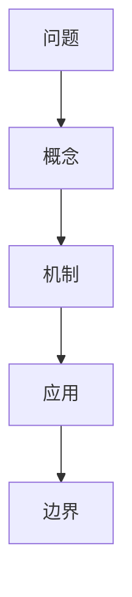

#### 批判性分析
- 前提：
- 证据：
- 逻辑：
- 边界：
- 反例：

#### 费曼复述

#### 行动转化

#### 复习记录
- D+1：
- D+7：
- D+30：
````

---

### 概念卡模板

```markdown
---
title: ""
tags:
  - 概念卡
aliases: []
source: "零基础学AI"
---

### 概念名

#### 定义

#### 用自己的话说

#### 为什么重要

#### 典型例子

#### 容易混淆

#### 相关概念
-
-

#### 一个问题

#### 一个行动
```

---

### 费曼输出模板

#### 使用方法

选一个概念或章节，假设听众是“完全没有 AI 背景的朋友”。不要使用未解释的术语。

#### 模板

```markdown
### 我要解释的主题：

#### 1. 一句话解释

#### 2. 生活类比

#### 3. 它为什么重要

#### 4. 最容易误解的地方

#### 5. 一个具体例子

#### 6. 我还有哪里讲不清楚

#### 7. 下一步查证
```

#### 示例：《思考，快与慢》的费曼式解释

主题：系统 1 与系统 2

- 系统 1 像自动驾驶，反应快、节省精力，但容易被直觉误导。
- 系统 2 像手动驾驶，慢、耗能，但适合处理复杂计算和逻辑判断。
- 读 AI 推理模型时，可以借这个框架理解：普通模型更像快速直觉，推理模型更像在关键任务中启动慢思考。

---

### 批判性分析模板

```markdown
### 分析对象

#### 作者主张

#### 隐含前提

#### 论据

#### 逻辑链

#### 可能反例

#### 未回答的问题

#### 与其他知识的连接

#### 我的暂定结论

#### 置信度
- [ ] 低
- [ ] 中
- [ ] 高
```

#### 判断标准

| 维度 | 检查问题                               |
| ---- | -------------------------------------- |
| 前提 | 作者默认了什么？这些前提成立吗？       |
| 证据 | 是事实、案例、类比，还是推测？         |
| 逻辑 | 从证据到结论是否存在跳跃？             |
| 范围 | 结论适用于哪些场景，不适用于哪些场景？ |
| 反例 | 有没有明显例外？                       |

---

### AI工具实践记录模板

```markdown
### 工具/模型名称：

#### 任务

#### 输入材料

#### 提示词/上下文

#### 输出结果

#### 质量评估
| 维度     | 评分 | 说明 |
| -------- | ---: | ---- |
| 正确性   |      |      |
| 完整性   |      |      |
| 可执行性 |      |      |
| 风格匹配 |      |      |
| 可验证性 |      |      |

#### 迭代记录

#### 最终结论

#### 可复用模式
```

---

## 复习系统

### 间隔重复计划

#### 基本节奏

| 时间点       | 操作     | 标准                     |
| ------------ | -------- | ------------------------ |
| 阅读后 1 天  | 快速回忆 | 不看笔记说出 3 个要点    |
| 阅读后 7 天  | 概念连接 | 至少新增 3 条双链        |
| 阅读后 30 天 | 输出复述 | 写 300-800 字复盘        |
| 阅读后 90 天 | 应用检验 | 用一个真实任务验证该知识 |

#### 每章复习清单

- [ ] Ch01｜走进人工智能世界：D+1 / D+7 / D+30 / D+90
- [ ] Ch02｜AI 核心概念速览：D+1 / D+7 / D+30 / D+90
- [ ] Ch03｜AI 技术生态与工具全景：D+1 / D+7 / D+30 / D+90
- [ ] Ch04｜机器学习原理：D+1 / D+7 / D+30 / D+90
- [ ] Ch05｜深度学习揭秘：D+1 / D+7 / D+30 / D+90
- [ ] Ch06｜大语言模型详解：D+1 / D+7 / D+30 / D+90
- [ ] Ch07｜推理模型与推理计算：D+1 / D+7 / D+30 / D+90
- [ ] Ch08｜新架构与创新案例：D+1 / D+7 / D+30 / D+90
- [ ] Ch09｜多模态与生成式 AI：D+1 / D+7 / D+30 / D+90
- [ ] Ch10｜主流 AI 工具使用指南：D+1 / D+7 / D+30 / D+90
- [ ] Ch11｜提示词工程入门：D+1 / D+7 / D+30 / D+90
- [ ] Ch12｜提示词工程进阶与上下文工程：D+1 / D+7 / D+30 / D+90
- [ ] Ch13｜AI 实战应用场景：D+1 / D+7 / D+30 / D+90
- [ ] Ch14｜AI 智能体与多智能体系统：D+1 / D+7 / D+30 / D+90
- [ ] Ch15｜AI 伦理、安全与未来：D+1 / D+7 / D+30 / D+90
- [ ] Ch16｜AI 硬件与量子计算入门：D+1 / D+7 / D+30 / D+90

#### 卡片复习提示

概念卡不要背定义，优先回答：

1. 它解决什么问题？
2. 它和哪些概念容易混淆？
3. 它在现实任务中如何出现？
4. 如果条件变化，它还成立吗？

---

### 阅读日志

| 日期 | 章节 | 用时 | 完成内容 | 最大收获 | 最大疑问 | 下一步 |
| ---- | ---- | ---: | -------- | -------- | -------- | ------ |
|      |      |      |          |          |          |        |

---

### 每章复盘表

```markdown
### 章节：

#### 一句话总结

#### 三个关键词
1.
2.
3.

#### 作者最重要的主张

#### 我同意的地方

#### 我怀疑的地方

#### 能应用到哪里

#### 需要外部补充的资料

#### 复习日期
- D+1：
- D+7：
- D+30：
```

---

## 实战练习

### AI工作流拆解练习

#### 练习目标

把一个真实任务拆成 AI 可参与的工作流，而不是泛泛地说“用 AI 提效”。

#### 步骤

1. 选择一个任务：例如写报告、做资料搜集、翻译、代码审查、读论文。
2. 写出任务输入：资料、限制、标准、受众。
3. 写出处理步骤：哪些由人做，哪些由 AI 做。
4. 写出输出标准：如何判断结果合格。
5. 写出风险控制：哪些地方必须人工复核。

#### 模板

| 环节     | 人类职责 | AI职责 | 输入 | 输出 | 风险 |
| -------- | -------- | ------ | ---- | ---- | ---- |
| 需求澄清 |          |        |      |      |      |
| 资料整理 |          |        |      |      |      |
| 初稿生成 |          |        |      |      |      |
| 校验修订 |          |        |      |      |      |
| 最终交付 |          |        |      |      |      |

#### 连接章节

- Ch11｜提示词工程入门
- Ch12｜提示词工程进阶与上下文工程
- Ch13｜AI 实战应用场景
- Ch14｜AI 智能体与多智能体系统

---

### 提示词改写练习

#### 低质量提示词

> 帮我写一份 AI 报告。

#### 改写框架

```markdown
角色：你是一名……
任务：请完成……
背景：我正在……
材料：以下是……
约束：不要……必须……
输出格式：请用……
验收标准：结果应满足……
```

#### 自练区

1. 原提示词：
2. 问题诊断：
3. 改写版本：
4. 输出评估：

---

### RAG与上下文工程方案草图

#### 场景

构建一个“个人 AI 学习助手”，让它回答与你的笔记、PDF、课程资料相关的问题。

#### 架构草图

```mermaid
graph TD
A[个人资料库] --> B[切分/清洗]
B --> C[向量化]
C --> D[向量数据库]
E[用户问题] --> F[检索]
D --> F
F --> G[组装上下文]
G --> H[大语言模型]
H --> I[带引用的回答]
I --> J[人工校验]
```

#### 关键设计问题

- 文档如何切分？
- 检索结果多少条合适？
- 如何避免模型编造引用？
- 什么问题必须返回“资料不足”？
- 哪些任务需要接入工具而不只是检索？

---

### 智能体设计练习

#### 目标

设计一个低风险、小范围、可观测的智能体任务。

#### 设计表

| 模块       | 设计 |
| ---------- | ---- |
| 目标       |      |
| 输入       |      |
| 工具       |      |
| 记忆       |      |
| 规划步骤   |      |
| 人工审批点 |      |
| 成功标准   |      |
| 失败处理   |      |
| 成本控制   |      |

#### 风险清单

- [ ] 工具权限过大
- [ ] 没有人类确认就执行不可逆操作
- [ ] 输出无法追溯来源
- [ ] 多智能体互相放大错误
- [ ] 成本不可控

---

## 原文线索

### 原书目录索引

#### 基本信息

- 书名：零基础学AI
- 作者：yeasy
- 版本：1.0.3
- 日期：2026-04-05
- 格式：PDF，mdPress 构建

#### 章节目录

- Ch01｜走进人工智能世界
- Ch02｜AI 核心概念速览
- Ch03｜AI 技术生态与工具全景
- Ch04｜机器学习原理
- Ch05｜深度学习揭秘
- Ch06｜大语言模型详解
- Ch07｜推理模型与推理计算
- Ch08｜新架构与创新案例
- Ch09｜多模态与生成式 AI
- Ch10｜主流 AI 工具使用指南
- Ch11｜提示词工程入门
- Ch12｜提示词工程进阶与上下文工程
- Ch13｜AI 实战应用场景
- Ch14｜AI 智能体与多智能体系统
- Ch15｜AI 伦理、安全与未来
- Ch16｜AI 硬件与量子计算入门

#### 附录

- 附录 A：AI 核心术语表
- 附录 B：常用 AI 工具与资源汇总
- 附录 C：推荐阅读与学习资源
- 附录 D：AI 学习路线图
- 附录 E：工程师配套实验代码

#### 注意

本索引用于定位阅读，不替代原书。精读时建议在每个章节笔记中补充原文页码、摘录和自己的批注。

---

### 原书摘录占位

> 精读时把原书中真正击中你的句子摘到这里。每条摘录都应附页码、章节和自己的解释。

#### 摘录模板

```markdown
#### 摘录标题

- 章节：
- 页码：
- 原文：
- 我的解释：
- 关联概念：
- 可转化为：概念卡 / 问题卡 / 行动卡
```

---
